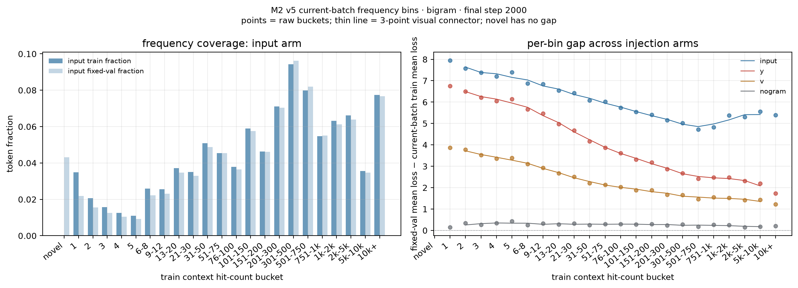
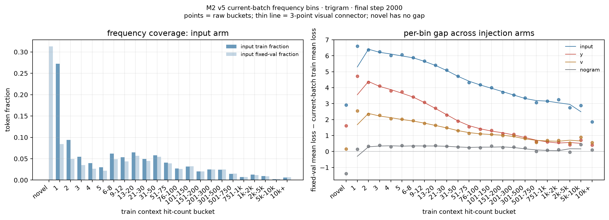
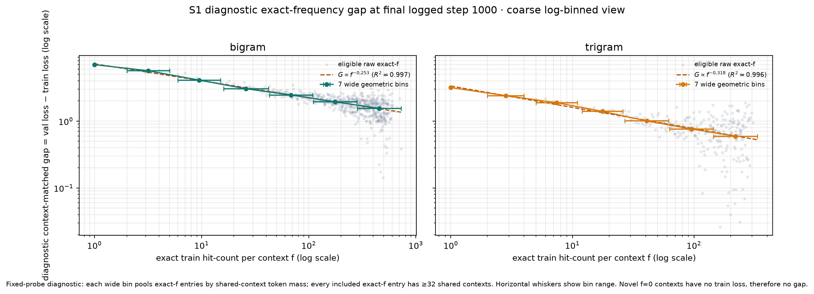
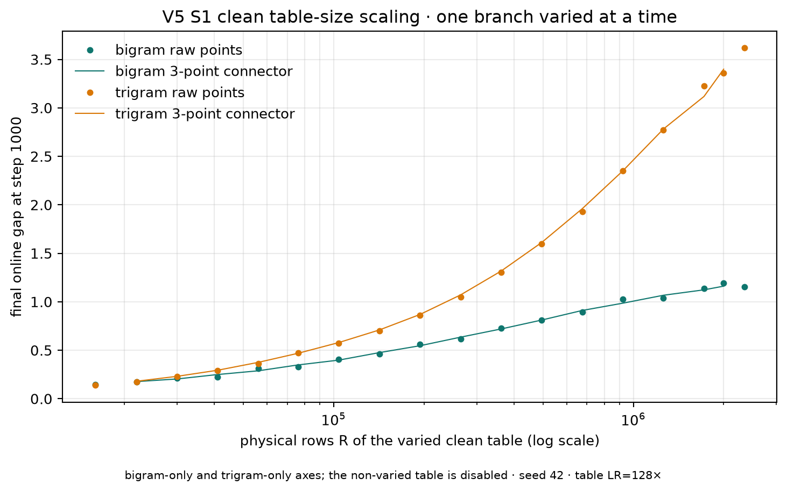
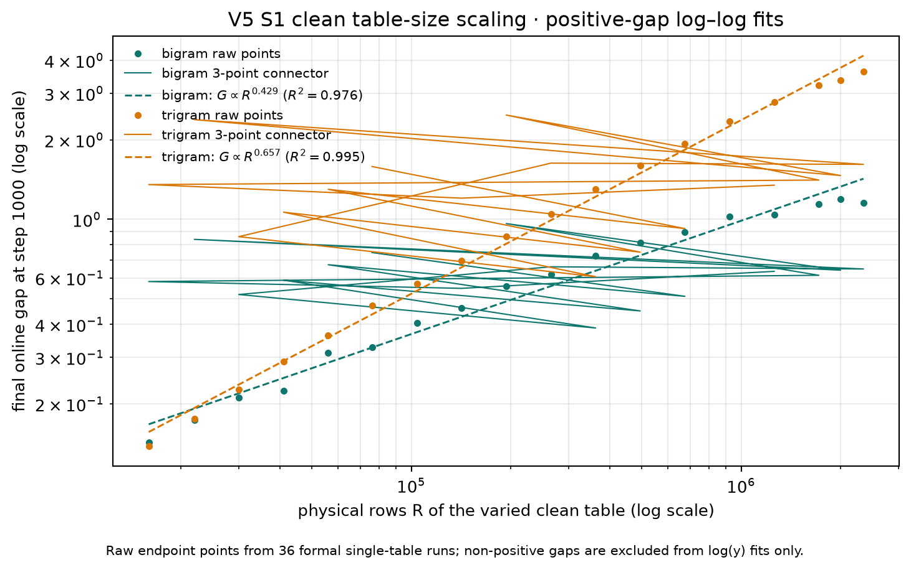
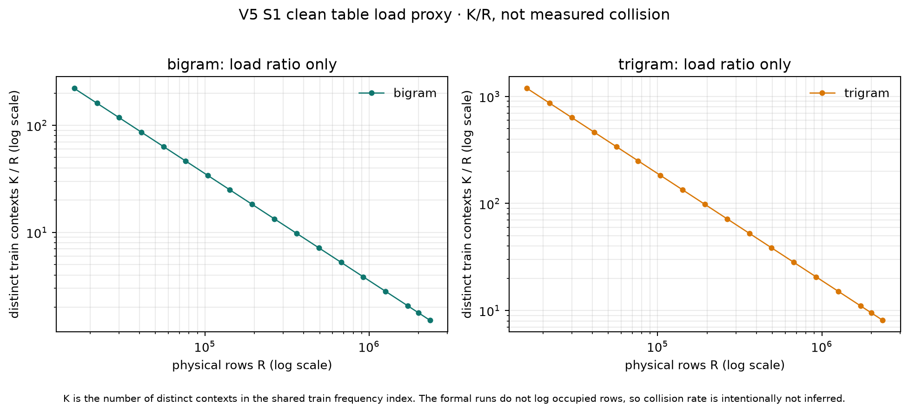
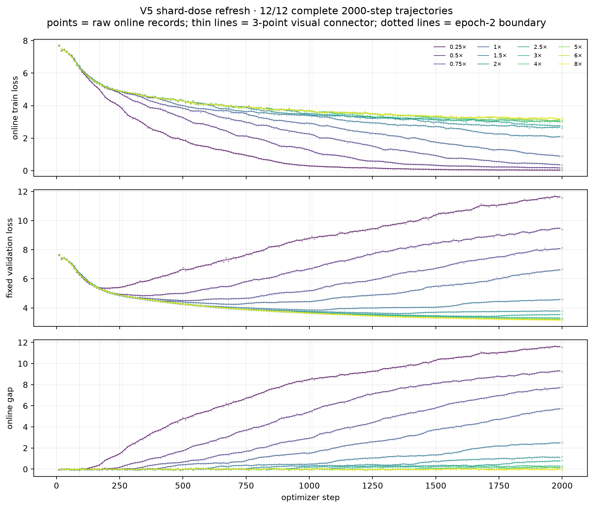
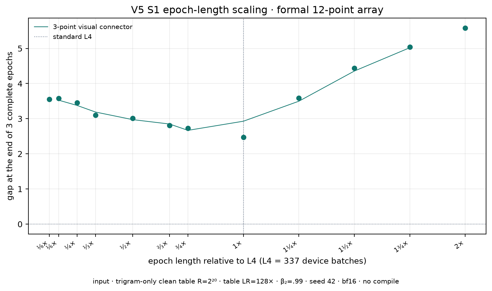
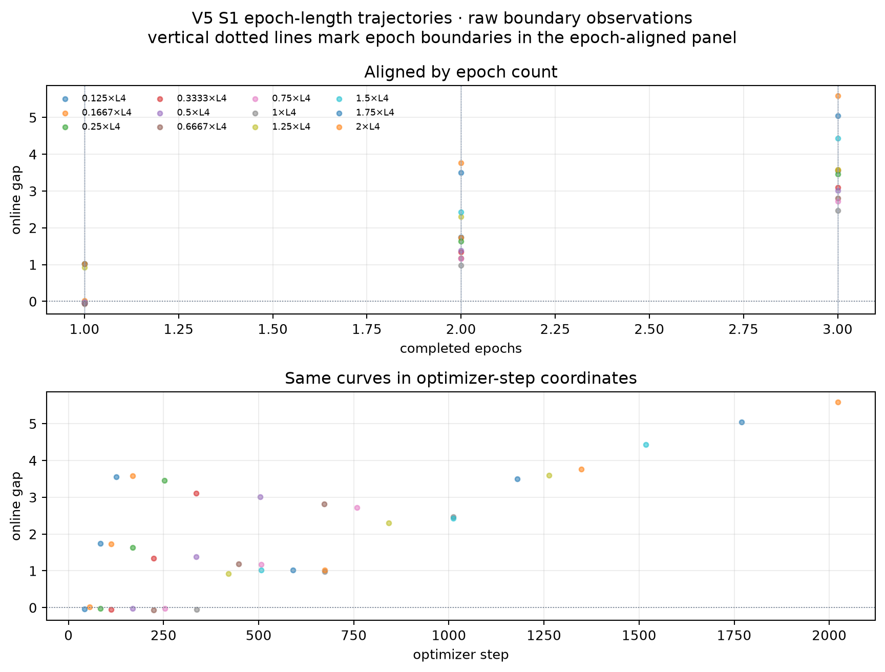

# 附录 · S1 三轴 scaling 验证

> **这页只回答三个关系**：真实 context 的训练频率 `f`、clean table 大小 `R`，以及 replay exposure `L` 如何对应 gap。当前可展示的 v5 结果位于页首；旧 `torch.compile` 波次完整保留在下方折叠区，只作溯源。
>
> **当前口径**：bf16 autocast、默认不 compile；主 gap = 同一 logged step 的 `fixed val loss − current-batch train loss`。除特别标注外，不把诊断 probe 或旧波次拟合升级成普适定律。

## 先看关系：v5 主线

| 关系 | 当前可见摘要 | 不能从中读出的结论 |
|---|---|---|
| 真实 context frequency `f` → gap | 7 个宽几何 bin 的诊断摘要：bigram `G(f)∝f^-0.252746`（R²=0.997165），trigram `G(f)∝f^-0.318121`（R²=0.995548）。`hit count` 是 hash 前同一真实 n-gram context 在训练语料中出现的次数；它不是 table row load。 | 不是 table hit count；当前单 seed 的斜率不是普适常数。 |
| clean table 大小 `R` → gap | 两条正式单表轴：bigram-only `G_bi(R)∝R^0.429`、trigram-only `G_tri(R)∝R^0.658`（各 18 点，seed 42，step 1000；R² 分别为 .976/.995）。另一张表在每条轴上关闭。 | 不是一个把两张表绑定在一起的 `G_both(R)` 指数；两条 branch 不能合并拟合。 |
| fixed-step 数据剂量 `D` → gap | v5 seed 42 在 step 2000 从 `D=.25×` 的 11.536 单调降至 `D=5×` 的 0.084，并在 6× 后穿过 0。 | 不是一条全区间幂律；局部斜率随窗口显著变陡。 |
| epoch length `L` → gap | 12 个 trigram-only、相对标准 `L4` 的 v5 点，每个 run 完成 3 个 epoch；U 形，1.0×L4 最低 gap=2.469。 | 不拟合幂律，不作独立因果律。 |

> **读图规则**：频率图横轴是 exact context frequency；table 图横轴是每个 clean table 的物理行数 `R`。table occupancy / collision 是解释 `R` 效应的另一条观测轴，不能替代 `f`。

## 1. 频率分 bin：先看真实 context frequency，不看 table hit count

主展示采用 v5 M2 的**当前训练 batch**频率分 bin（step 2000；每 10 步记录）。因此这里的 gap 符合当前主口径。它回答的是：在自然语料中，不同出现次数的真实 context 对应怎样的 token-level gap；不是 hash row 被写入多少次。



*Bigram：v5 当前 batch 的 frequency-bin gap。横轴为真实 bigram context 的训练频率。*



*Trigram：v5 当前 batch 的 frequency-bin gap。与 bigram 使用同一“hash 前真实 context”口径。*

作为更细的 *exact-f* 形状诊断，S1 v5 把 eligible exact-f 条目按对数范围合并为 **7 个宽几何 bin**；每个 bin 内按 shared-context token mass 加权，高频尾部不再由少数 exact-f 点主导。seed 42、step 1000 的双对数摘要为：**bigram `G(f)∝f^-0.252746`（R²=0.997165），trigram `G(f)∝f^-0.318121`（R²=0.995548）**。这两个数使用 fixed train probe，且只有单 seed；它们是当前诊断图中很清楚的**局部形状摘要**，仍不是普适幂律指数的结论。



*v5 S1 exact-frequency 诊断：7 个宽几何 bin、横向 whisker 为 bin 范围；图例直接标出 branch-wise log-log 摘要。不以 fixed-probe gap 替代上方主口径。*

## 2. 表大小：clean table 的 R → gap 双对数关系

这里 `R` 是被改变的 clean 单表物理行数；另一张表在该轴中关闭。bigram-only 与 trigram-only 是两条独立的单表轴：**`G_bi(R) ∝ R^0.429`**、**`G_tri(R) ∝ R^0.658`**（各 18 个正终点，seed 42，step 1000，R² 分别为 .976/.995）。这两个描述性指数只对应当前扫描窗口，不能合并成一个双表指数；相较此前双表轴的 .041/.247，单表设计消除了固定背景 gap 的斜率稀释。



*v5 clean table size：bigram-only 与 trigram-only 分支分别变化；横轴为物理行数 `R`，另一张表关闭。*



*v5 clean table size：正 gap 端点的双对数图；bigram / trigram 的 log-log 拟合摘要分别为 `+0.429` / `+0.658`。*



*K/R 只是 distinct-context load proxy；正式 run 未记录 occupied rows，因此不报告 collision rate，也不把 K/R 当成 frequency-bin hit count。*

### 2.1 数据剂量：强单调 dilution，但不是单一幂律

这里 `D` 是训练 shard dose；总训练步数固定为 2000，因此 D 越大，每个样本在该预算内被 replay 的次数越少。v5 frequency-refresh 扫描（seed 42）从 `D=.25×` 的 gap 11.536 下降到 `D=5×` 的 0.084，`D=6×/8×` 为 −0.088/−0.075。它是很强的剂量/重复暴露关系，但不宜命名为一条全区间 `G(D)∝D^{-α}`：正 gap 的 5× 以内拟合斜率为 `−1.727`（R²=0.887），随后 gap 过零而 log(y) 不再定义。这说明当前曲线是 crossover 到 near-zero floor，而不是常数指数。



*v5 dose refresh：显示 12 个 dose 的 online train / fixed validation / online gap 原始轨迹；细线仅为 3 点视觉连接。*

## 3. Replay exposure：保留为相邻关系，不宣称幂律

v5 的 trigram-only epoch-length 阵列只有单 seed。它用于把“频率效应”和“训练流重复暴露”并列观察；当前证据不足以写出稳定的 `G(L)` 幂律或独立因果关系。



*v5 epoch-length scaling：12 个 trigram-only、相对标准 `L4` 的 epoch-length 点，横轴直接使用 `L4` 倍数，不使用 L1–L4 jargon。*



*v5 epoch-length trajectories：各 run 的原始在线 gap 与 epoch boundary 观察。*

<details>
<summary>展开历史 S1 审计（261 个 compile run、旧表架构与旧拟合；保留，不作为页首结论）</summary>

## 0. 研究问题与 claim boundary

在唯一极简 setting（vanilla nanoGPT 8L·6H·768D、learned absolute
position、LayerNorm、tied embedding、input/wte n-gram 注入、自然语料）下，
本附录分别检查：

1. epoch 长度 `L` 在 fixed-step 与 fixed-epoch 两种对齐下如何影响 gap；
2. exact context frequency `f` 与 gap 是否符合两因素形式
   `G(f) = A f^(-β) [1 − exp(−c f^γ)]`；
3. table size 从默认 1M logical addresses 向下缩放时，gap 如何随 logical
   addresses 和 collision 改变。

本报告中的历史 gap 数值来自同一 fixed train probe 和 fixed validation probe 上的
`fixed_val_loss − fixed_train_loss`；这些结果保留用于历史追溯，但该口径现已标记为
exposure-contaminated 诊断，不再作为主结论。三 seed 汇总部分改用旧波次产物中
`train_log.jsonl` 的在线训练 batch：`val_loss − train_loss`，但其 compute contract
仍是 `bf16 + torch.compile`。最新标准 gap 仍定义为在线训练 batch 与 fixed validation
的 `val_loss − train_loss`，并要求 bf16 不 compile。frequency 轴只做自然语料下的
**observational consistency** 检验，不是 `f` 的因果证明。除非特别注明，数值均为
对应 run 的最终 step；没有当前标准重跑时，不把旧波次结果升级为新标准下稳定
的指数或定律。

## 1. 冻结 setting

| 项 | 值 |
|---|---|
| backbone | vanilla nanoGPT，8L / 6H / 768D，learned absolute position，LayerNorm，tied embedding |
| n-gram 注入 | `input` / wte over-encoding |
| 模块臂 | `bigram`、`trigram`、`both`、`nogram` |
| table optimizer | RMSProp，无动量，`table_betas=(0.0, 0.99)` |
| table learning-rate scale | `table_lr_scale=2.0`，实际 table lr 为 0.008 |
| backbone optimizer | AdamW，betas `(0.8, 0.95)`，lr 0.004 |
| 数据 | shard 1 fixed 顺序 replay；train / val shard 完全不重叠 |
| 历史计算 | S1 261-run 波次为 bf16 autocast + `torch.compile`，仅作历史审计 |
| 当前计算标准 | bf16 autocast，默认不 `torch.compile`；当前标准 S1 scaling 结果尚未重跑 |
| 历史测量 | fixed train probe（4 batches）+ fixed validation；probe SHA256 为 `38d1254a827759d6` |
| 当前主测量 | online train loss + fixed validation，即 `val_loss − train_loss`；fixed probe 仅诊断 |
| cadence | 当前默认主实验为每 10 步；只需曲线可用每 50 步；只需末端可用 `--val_steps 1000`；frequency eval 必须跟随所选测量步点 |
| 结果命名 | `data/runs_scaling/<run_id>_fixed/` |

历史普通 epoch/table 网格不计算 exact-frequency，也不传 `--freq_index`，只保留
在线 train/val 与 online gap 指标；fixed-probe 仅作诊断；历史 frequency 轴单独使用
`freq_{arm}_{fs,fe}_fixed` 八个 run，并开启 exact-frequency 观测。按最新标准
重跑时，频率观测应按实验目的选择完整曲线或末端 `val_steps`，不能沿用旧波次
的 compile 假设。

## 2. 数据完整性与 QC（历史 S1 波次）

历史 S1 波次共 **seed 42：109 个 run + seed 43/44：各 76 个 run = 261 个 run**：

| 网格 | seed 42 | seed 43/44 各 | run 范围 | 最终 step |
|---|---:|---:|---|---:|
| epoch · fixed-step | 16 | 16 | `ep_L{1..4}_{bigram,trigram,both,nogram}_fs[_s{43,44}]_fixed` | 1000 |
| epoch · fixed-epoch | 16 | 16 | `ep_L{1..4}_{bigram,trigram,both,nogram}_fe[_s{43,44}]_fixed` | L1/L2/L3/L4 = 252/504/1008/2022 |
| table size | 69 | 36 | seed 42：23 个 mult × 3 module；seed 43/44：12 个 mult（1,2,3,4,6,8,12,16,24,32,48,64）× 3 module | 1000 |
| frequency axis | 8 | 8 | `freq_{bigram,trigram,both,nogram}_{fs,fe}[_s{43,44}]_fixed` | fs=1000，fe=2022 |

这 261 个历史 run 均通过当时计算契约下的统一 QC：

- `summary.json` 存在且 run id、步数、epoch batches 与命名一致；
- 261 个 run 使用 `compute_dtype=bf16`、`torch_compile=true`、RMSProp `(0.0,0.99)`、
  `table_lr_scale=2.0`。其中 `torch_compile=true` 是旧波次事实，不符合最新
  `agents.md` 的默认标准；
- 原始 epoch 网格、21 个 table dense run 及 frequency 轴的 validation/table norm
  cadence 为 10 步；48 个 seed-42 与全部 72 个 seed-43/44 table sparse run 的
  val/table norm 只在最终 step 1000 触发；
- seed 42 正式 run 的 fixed train probe SHA256 全部为
  `38d1254a827759d6`；
- JSON/JSONL 产物无 NaN、无坏行；table 网格均有
  `table_occupancy.json`；
- 历史网格无缺失 run，无异常 loss；这不等价于当前 no-compile 标准已通过 QC。

当前标准下的 S1 epoch/table/frequency 重跑尚未产生可纳入本报告的结果，因此
后文所有三 seed 数字都应读作“旧计算契约下的探索性数学审计”。

独立的 `bb_safety_L1_nogram_5000` 不是这 109 个正式 run 的一部分：它使用
旧 cadence（50 步）和 fp32、无 compile，只作为长训 backbone gap 的量级
参考。它在 step 5000 的 fixed train / val / gap 为
`0.0065 / 16.666 / +16.660`。因此正式 `nogram` 对照不能被假设为恒等于零。

## 3. Epoch-length scaling

L4 按用户决策定义为 **337 device batches/epoch**，即 shard 1 的完整
`24,264 / 72` 个 batch；L1/L2/L3 为同一 shard 流的嵌套前缀
42/84/168。正式结果中的 epoch batches 为：

| L | batches/epoch | fixed-step target | fixed-epoch target |
|---|---:|---:|---:|
| L1 | 42 | 1000 | 252 |
| L2 | 84 | 1000 | 504 |
| L3 | 168 | 1000 | 1008 |
| L4 | 337 | 1000 | 2022 |

### 3.1 历史最终 fixed gap（seed 42；仅诊断）

下表来自 `ep_{L}_{module}_{align}_fixed` 的最终 probe 记录；每个格子的
step 分别由上表给出。

| L | bigram fs | trigram fs | both fs | nogram fs | bigram fe | trigram fe | both fe | nogram fe |
|---|---:|---:|---:|---:|---:|---:|---:|---:|
| L1 | 5.0698 | 1.4811 | **10.8446** | 0.1223 | 0.6031 | 0.4810 | 1.0079 | 0.0639 |
| L2 | 2.2394 | 1.1632 | 6.0760 | 0.0289 | 1.1779 | 0.8657 | 1.8853 | 0.0664 |
| L3 | 1.6309 | 1.5637 | 2.0769 | 0.0072 | 1.8447 | 2.2188 | **5.9113** | 0.0500 |
| L4 | 0.9406 | 0.8682 | 0.9696 | −0.0087 | 1.1759 | **6.0557** | 2.2658 | 0.1974 |

### 3.2 单 seed 可支持的观察

- fixed-step 下，`both` 的 raw gap 从
  `ep_L1_both_fs_fixed` 的 **+10.8446 @ step 1000** 降到
  `ep_L4_both_fs_fixed` 的 **+0.9696 @ step 1000**；但 no-ngram 基线也
  随 L 改变，主比较应使用图中的
  `ΔG = G(module) − G(no-ngram)`，不能只比较 raw gap。
- fixed-epoch 下，结果明显不是一条简单的 L 单调曲线：
  `ep_L3_both_fe_fixed` 在 step 1008 为 **+5.9113**，而
  `ep_L4_trigram_fe_fixed` 在 step 2022 为 **+6.0557**。
- 因此 seed 42 显示出 alignment-dependent 的 replay / epoch 结构，但
  不能仅凭这一 seed 拟合或宣称 epoch-length scaling 定律。

图：

- `figs/epoch_gap_by_alignment.png`：16 个 epoch run 的历史 fixed-probe gap；
- `figs/epoch_deltaG_fs.png`：fixed-step 下相对各 L no-ngram 的 `ΔG`；
- `figs/epoch_final_gap.csv`：逐 run 最终 gap 表。

## 4. Table-size scaling

所有 table run 固定 L4（337 batches/epoch）、1000 steps、seed 42，唯一变化
是 `table_mult`。共 23 个实测规模；bigram/trigram/both 各 23 点。原始 7
个规模的 21 个 run 使用 dense monitor（每 10 步），其余 48 个加密 run 使用
sparse monitor（只在最终步 1000 记录 gap）。每个 n-gram、每层、两组 hash
的 logical addresses 为
`2R = 16,384 × table_mult`。

| `table_mult` | logical `2R` | bigram online gap | trigram online gap | both online gap |
|---:|---:|---:|---:|---:|
| 1 | 16,384 | 0.0914 | 0.0686 | 0.0983 |
| 2 | 32,768 | 0.1021 | 0.0636 | 0.1319 |
| 3 | 49,152 | 0.1145 | 0.1419 | 0.2157 |
| 4 | 65,536 | 0.1527 | 0.1717 | 0.2163 |
| 5 | 81,920 | 0.1550 | 0.1517 | 0.2552 |
| 6 | 98,304 | 0.2342 | 0.1699 | 0.3142 |
| 7 | 114,688 | 0.1764 | 0.1700 | 0.3592 |
| 8 | 131,072 | 0.1958 | 0.2722 | 0.3225 |
| 9 | 147,456 | 0.2163 | 0.2958 | 0.2887 |
| 10 | 163,840 | 0.2086 | 0.3351 | 0.3238 |
| 12 | 196,608 | 0.2223 | 0.2897 | 0.4594 |
| 14 | 229,376 | 0.2776 | 0.3294 | 0.4324 |
| 16 | 262,144 | 0.2663 | 0.3569 | 0.5429 |
| 18 | 294,912 | 0.2591 | 0.4364 | 0.5714 |
| 20 | 327,680 | 0.4594 | 0.4801 | 0.7584 |
| 24 | 393,216 | 0.3386 | 0.4962 | 0.5570 |
| 28 | 458,752 | 0.3239 | 0.6350 | 0.6847 |
| 32 | 524,288 | 0.3032 | 0.7170 | 0.6978 |
| 36 | 589,824 | 0.7663 | 0.5966 | 0.8062 |
| 40 | 655,360 | 0.3866 | 0.6999 | 0.8418 |
| 48 | 786,432 | 0.4457 | 0.8780 | 2.2445 |
| 56 | 917,504 | 0.4199 | 1.0232 | 2.2568 |
| 64 | 1,048,576 | **0.9985** | 0.8606 | **2.2462** |

表中数值来自 `tbl_{mult}_{module}_fixed` 的 final **online** gap
`val_loss − train_loss` @ step 1000；其中 train loss 是当前在线训练 batch，
val loss 是同一步的 fixed validation。第一轮加密取点为
`mult=48,24,12,6,3` 的 15 个 run，第二轮新增
`mult=56,40,36,28,20,18,14,10,9,7,5` 的 33 个 module run（包含
`both`）。所有 sparse run 只保存最终点，不产生中间曲线，因此没有把稀疏
观测伪装成完整训练轨迹。seed 42 下三条 module 曲线总体随 table 增大，
但并非逐点单调；`both` 在大表区的 gap 最大（`tbl_56_both_fixed`，
**+2.2568**）。这支持“更大的 table 保留更多低频 context-specific 更新、
从而可能放大 gap”的候选机制；它不是仅凭参数量就能证明的因果结论。

同一批 occupancy 结果中，bigram layer-0/hash-0 的 collision rate 从
`0.9977`（16,384 addresses）降到 `0.8521`（1,048,576 addresses），而
occupancy 从约 1.0 降到 0.9983。该 collision 方向与 gap 的上升方向一致，
但只有一个 seed，且 collision 与 table size 共变，尚不能区分两者的独立
贡献或证明 saturation。

加密取点解决的是横轴取点过稀，不会消除单 seed 的纵轴噪声。例如 bigram
在 `mult=6→7`、`24→28` 处回落，trigram 在 `32→36`、`56→64` 处回落；
因此双对数图看起来不完美线性，主要是单 seed 波动与强碰撞区的非理想
响应，不是简单增加横轴点数就能修复。图中的虚线只是 log-log
guide，不是已确认的幂律。

图和摘要（均纳入 69 个 table 点）：

- `figs/table_gap_vs_2R.png`：双对数坐标，使用 final online gap；虚线仅为
  log-log guide，不是 scaling-law claim；
- `figs/table_gap_vs_collision.png`：横轴使用 `1 − collision_rate` 的
  双对数视图，因为 collision rate 本身接近 1，不能直接取对数；
- `figs/table_gap_vs_2R.html` / `figs/table_gap_vs_collision.html`：交互版；
  可点击 legend 隐藏/显示 module 曲线，并分别切换 x/y 轴为 linear 或 log；
- `figs/table_summary.csv`；
- `table_occupancy.json` 位于每个 `tbl_*_fixed` 目录。

### 4.1 Row-level recovery pilot（bigram，seed 42）

为检查 table-size 效应是否来自“某些高命中 row”，额外保存
`final_model.pt`，在固定 train/val probe 上离线重算 layer 0、hash 0/1
的逐 row train/val token loss。row-level gap 只在 train/val 都命中的 row
上定义，因此它是 overlap subset 的诊断统计，不替代上面的全 probe
`final_fixed_gap`。

对 `table_mult=64,32,16,8,4,2,1` 的 7 档结果，按 train-token 数加权的
overlap-row mean gap 分别约为 `1.883, 0.267, 0.201, 0.159, 0.102,
0.052, 0.043`。但在每个 table size 内，gap 与 row 的 distinct-context
load 的加权 log-slope 都接近 0（加权 R² 约为 0），以实际 train-token
hits 为横轴时同样没有可辨识的趋势。也就是说，当前 pilot 支持
“table size 改变整体 gap，而单个 row 的命中次数/碰撞负载不是主要的一维
解释变量”；它还不能排除 context identity、训练历史或 module interaction
的作用。图 `figs/rowlevel_gap_vs_table_size.png` 同时展示 row-level
分布、load 分箱曲线，以及与正式 fixed gap 的对照。

## 5. Exact-frequency axis

frequency 轴使用 L4 + 1M table 的
`freq_{bigram,trigram,both,nogram}_{fs,fe}_fixed`。历史最终 fixed-step
frequency 图取 step 1000 的 `freq_{module}_fs_fixed/exact_freq_loss.jsonl`；
满足 `token_count >= 1024` 且 `distinct_contexts >= 32` 的 train/val
共同 exact-f 值才进入 marginal gap。`novel` 和没有 train loss 的 bucket
不定义 gap，也不进入 log-fit。

### 5.1 形状观察

`freq_gap_bigram_final.png` 和 `freq_gap_trigram_final.png` 显示：在 seed 42
的 L4 fixed-step 截面中，bigram 与 trigram branch 的 gap 通常随 exact
frequency 增大而下降；`nogram` 大多围绕零附近波动。高频端的点更噪，不能
把局部反弹写成单调性破坏或新的机制。

canonical 图使用从 eligible per-f 条目直接构造的 8 个等计数 log-f bins：
每个点的横坐标是 bin 内 exact-f 的几何中点，横向误差棒表示该 bin 的
`[f_min, f_max]` 范围，纵向误差棒是按 token 数加权后的 pooled SEM。
`freq_gap_bigram_final_raw.png` 和 `freq_gap_trigram_final_raw.png` 保留全部
eligible per-f 点及其 SEM，作为用户要求的 debug 原图；它们故意较为拥挤，
不作为主展示图。

### 5.2 两因素拟合（探索性）

分析脚本对 L4 fixed-step 的 bigram/trigram module 做 token-marginal
raw-space fit：
`G(f) = A f^(-β) [1 − exp(−c f^γ)]`。

| branch | module run | A | β | c | γ | eligible f | positive-fit f |
|---|---|---:|---:|---:|---:|---:|---:|
| bigram | `freq_bigram_fs_fixed` | 7.594 | 0.752 | 1.394 | 0.755 | 63 | 62 |
| bigram | `freq_trigram_fs_fixed` | 1.560 | 0.126 | 2.293 | 0.776 | 63 | 63 |
| trigram | `freq_bigram_fs_fixed` | 1.147 | 0.544 | 1.980 | ~0 | 57 | 51 |
| trigram | `freq_trigram_fs_fixed` | 1.922 | 0.560 | 0.709 | 0.748 | 57 | 54 |

完整参数、标准误以及每个被排除的 exact-f 和原因记录在
`figs/fit_manifest.json`。拟合只保留 positive gap；不满足 train/val
token/context 纳入门槛的频率也被逐项记录。trigram branch 的
`freq_bigram_fs_fixed` 拟合出现 `γ≈0` 且参数标准误很大，说明单 seed /
当前覆盖下可辨识性不足。因此这些数字只能作为形状的 exploratory summary，
不能作为稳定的 `A, β, c, γ` 估计，也不能替代计划中的 epoch 截面、
profile-likelihood 和 seed 43/44。

## 6. 多 seed 复现与数学猜想检验（2026-08-25，H1–H4）

以下全部基于 **online gap 主口径**（`val_loss − train_loss`，`train_log.jsonl`），
三 seed（42/43/44）汇总。跨 seed 变异度用 cv = std/mean 表示；
结论强度按 plan-5 约定标注为 `seed-stable` / `seed-sensitive` /
`identifiability-limited` / `not yet causal`。

### 7.1 H2：epoch 对齐律 —— 方向 seed-stable，幅度 fixed-epoch 更稳

`ΔG = G(module) − G(no-ngram)`（online final gap）在全部
**24/24 个 (L × module × 对齐) 组合 × 3 seed 中均为正**，方向 seed-stable。

fixed-step（1000 步，ΔG，三 seed）：

| L | bigram | trigram | both |
|---|---|---|---|
| L1 | +4.99 / +2.14 / +1.50 | +1.37 / +1.11 / +1.43 | +10.72 / +2.67 / +11.03 |
| L2 | +2.27 / +1.54 / +1.60 | +1.13 / +4.02 / +4.72 | +6.14 / +4.04 / +6.73 |
| L3 | +1.60 / +1.05 / +1.03 | +1.64 / +1.63 / +2.38 | +2.10 / +2.59 / +5.24 |
| L4 | +0.95 / +0.44 / +0.41 | +0.88 / +1.78 / +0.94 | +0.98 / +1.00 / +2.22 |

fixed-epoch（6 epoch，ΔG，三 seed）：

| L | bigram | trigram | both |
|---|---|---|---|
| L1 | +0.55 / +0.81 / +0.60 | +0.42 / +0.66 / +0.87 | +0.95 / +1.73 / +1.88 |
| L2 | +1.13 / +1.03 / +1.07 | +0.81 / +0.63 / +0.86 | +1.83 / +2.18 / +2.14 |
| L3 | +1.81 / +1.02 / +1.00 | +2.21 / +2.19 / +2.64 | +5.89 / +4.65 / +4.09 |
| L4 | +0.98 / +2.00 / +0.87 | **+5.90 / +5.72 / +5.56** | +2.08 / +5.45 / +5.47 |

- **方向**：seed-stable（24/24 同号为正）。
- **幅度**：fixed-step 幅度 seed-sensitive（L1_both 跨 seed 2.67–11.03，cv>50%）；
  **fixed-epoch 对齐显著更稳**，L4_trigram 三 seed 为 5.90/5.72/5.56（cv≈2%）——
  在相同重播次数下，epoch 长度 L4 的 trigram ΔG 是一个可复现的大效应。
- fixed-epoch 下 trigram ΔG 随 L 单调上升（0.42→0.81→2.21→5.90），
  三 seed 同趋势；这是"重播次数固定时，更长 epoch 的 trigram 注入放大 gap"
  的 seed-stable 证据，但仍为 observational（`not yet causal`）。

图：`figs/epoch_deltaG_fs_multiseed.png`（逐 seed 点 + 均值）；汇总表
`figs/epoch_final_gap.csv`（96 行，三 seed）。

### 7.2 H3：table collision/saturation 律 —— 有限窗口上升，但饱和未解析

table 轴三 seed（12 个公共 mult × 3 module，online final gap @1000）：

**trigram**（seed-stable，单调）：

| mult | s42 | s43 | s44 | cv |
|---:|---:|---:|---:|---:|
| 1 | 0.069 | 0.052 | 0.072 | 14% |
| 4 | 0.172 | 0.155 | 0.123 | 13% |
| 8 | 0.272 | 0.251 | 0.217 | 9% |
| 16 | 0.357 | 0.372 | 0.361 | 2% |
| 24 | 0.496 | 0.517 | 0.547 | 4% |
| 32 | 0.717 | 0.665 | 0.661 | 4% |
| 48 | 0.878 | 0.734 | 0.857 | 8% |
| 64 | 0.861 | 0.849 | 1.021 | 9% |

- trigram gap 在 mult 1→64 的观测窗口内总体上升，跨 seed 离散度为
  2–17%；mult 8–64 的 log-log 斜率约 0.6–1.0，只能作为有限窗口的
  形状摘要，不能升级为全区间幂律。
- seed 43/44 在 48→64 仍上升，但 seed 42 在 56→64 回落；因此当前窗口
  未解析出稳定的饱和平台，也不能据此否证饱和。是否存在 jamming/saturation
  转折，需要 no-compile 标准下的扩展 table 轴和更多 seed。

**bigram**：mult 8–32 稳（cv 2–13%），但 mult=6/24/48/64 个别点 cv 25–48%
（seed-sensitive 点）；总体随 mult 上升但无干净幂律。

**both**（不可定量）：mult≥16 后 cv 普遍 24–45%（如 mult=32：0.698/1.595/0.748；
mult=48：2.244/0.860/1.028）。**双表干涉导致 both 在大表区不可定量**，
不能合并进单一幂律公式（见 §6.4）。

图：`figs/table_gap_vs_2R.png`（双对数）/ `figs/table_gap_vs_collision.png`
/ 交互版 `.html`；汇总 `figs/table_summary.csv`（141 行，三 seed）。

### 7.3 H1：两因素频率律 —— β 可辨识，A/c/γ 不可辨识

对 L4 + 1M 锚点的 `freq_{module}_fs[_s{43,44}]_fixed`（step 1000 截面，
token-marginal）做 raw-space 拟合
`G(f) = A·f^(−β)·[1 − exp(−c·f^γ)]`，三 seed 参数 cv：

| branch / module | β（mean±sd） | γ | A | c |
|---|---|---|---|---|
| bigram/bigram | **0.713±0.029（cv 4%）** | cv 11% | cv 35% | cv 6% |
| bigram/trigram | **0.128±0.005（cv 4%）** | cv 7% | cv 33% | cv 6% |
| trigram/bigram | 0.483±0.044（cv 9%） | cv 141% | cv 38% | cv 91% |
| trigram/trigram | 0.673±0.088（cv 13%） | cv 6% | cv 64% | cv 39% |

- **β 是唯一 seed-stable 的可辨识参数**（四组 cv 4–13%）：gap 随 exact
  frequency 的衰减指数可复现，且 branch/module 组合间差异显著
  （bigram 表对 bigram context 的 β≈0.71 vs trigram context 的 β≈0.13）。
- **A 与 c 不可辨识**（cv 33–91%），trigram/bigram 交叉项的 γ 与 c 完全不可辨识
  （γ 在 0 与 1.87 间跳，c 在 2.0 与 27.5 间跳）。
- 结论：H1 的两因素形式与数据**方向一致**，但当前覆盖下只能可信地报告
  **衰减指数 β**；A/c/γ 为 `identifiability-limited`，不写绝对值。
  完整参数、标准误与逐 f 排除原因见 `figs/fit_manifest.json`（12 个拟合）。

### 7.4 H4：模块交互 —— 显著且 seed-sensitive，不允许合并单公式

epoch 网格（相对各 L no-ngram 的 ΔG）上的交互项
`I = ΔG_both − ΔG_bigram − ΔG_trigram`：

- **fixed-step**：I 跨 seed 大幅摆动且**变号**（L1：+4.37/−0.58/+8.10；
  L2：+2.74/−1.52/+0.42；L3/L4 同样正负混合）——seed-sensitive。
- **fixed-epoch**：I 同样非零且 L4 出现强负值（−4.80/−2.27/−0.96），
  方向在 L 间翻转（L1–L3 偏正，L4 偏负）。

table 网格上的交互（raw gap，无 nogram 对照）：
mult≤40 时 I 普遍为**小幅负值**（亚可加，−0.03~−0.56），三 seed 同号；
mult≥48 时 I 跨 seed 剧烈变号（mult=48：+0.92/−0.27/−0.90）——
大表区双表干涉 seed-sensitive。

**结论**：模块交互 I 显著非零且方向/幅度随 seed、对齐方式、表大小变化，
因此 **不允许把 bigram+trigram 合并成单一公式解释**；`both` 臂只作对照，
不进任何合并 scaling 定律。

### 7.5 对四个猜想的总判定

| 猜想 | 判定 | 依据 |
|---|---|---|
| H1 两因素频率律 | **β seed-stable（cv 4–13%）；A/c/γ identifiability-limited** | §6.3，三 seed 12 个拟合 |
| H2 epoch 对齐律 | **方向 seed-stable（24/24 同号）；幅度 fixed-step seed-sensitive、fixed-epoch 稳** | §6.1 |
| H3 table saturation | **有限窗口上升；饱和与全区间幂律均未解析；both 大表区不可定量** | §6.2 |
| H4 模块交互 | **显著且 seed-sensitive，不允许合并单公式** | §6.4 |

以上全部为 observational 证据；epoch/table 的方向性结论已满足
"三 seed 同号才写方向稳定"的登记标准，但不升级为因果 claim
（`not yet causal`）。

## 7. 关系图谱与绘图口径

本附录新增的关系图不把几条曲线简单叠在一起，而是按同一条证据链组织：

```text
table size (2R) ──┐
collision state ──┼──> table-induced online gap
exposure (L) ────┤
frequency (f) ───┘
```

图中的每个箭头都对应一个可测关系，不代表已经证明因果机制。变量和图的
对应关系如下：

| 关系 | 图 | 坐标与可见内容 | 读图目的 |
|---|---|---|---|
| `2R → gap` | `figs/rel_gap_vs_2R_multiseed.png` | 横纵轴均为 log；颜色区分 module，marker 区分 seed；虚线为每组的 log-log guide | 看 table 容量增加是否伴随 gap 上升、是否出现饱和 |
| `1−collision → gap` | `figs/rel_gap_vs_physical.png` | 横纵轴均为 log；collision 来自 bigram layer-0 hash-0 的 occupancy 统计 | 把逻辑地址关系投影到实际 hash 碰撞状态 |
| `L → ΔG` | `figs/rel_deltaG_vs_epoch.png` | 左 fixed-step，右 fixed-epoch；`ΔG = G(module)−G(nogram)`；线性 y 轴保留零线 | 区分计算步数对齐和 replay/epoch 对齐 |
| `f → gap(f)` | `figs/rel_gap_vs_frequency_bigram.png`、`figs/rel_gap_vs_frequency_trigram.png` | 横纵轴均为 log；fs/fe 并列；带 error bar 与 two-factor guide | 看 exact frequency 的衰减形状及其对齐依赖 |
| `E × f → gap(f)` | `figs/rel_gap_vs_frequency_epoch_bigram.png`、`figs/rel_gap_vs_frequency_epoch_trigram.png` | fixed-epoch 的 epoch 1/3/6 三截面；每个截面含三 seed、bin 内 SEM、拟合 guide | 检查频率关系随 exposure 是否改变 |
| 四轴总览 | `figs/rel_relationship_map.png` | `(a)` table，`(b)` collision，`(c)` fixed-epoch exposure，`(d)` trigram frequency | 作为报告的关系地图，不替代逐图检查 |

### 7.1 Exact-frequency 分 bin 与误差棒

频率图不是把旧的粗 bin 再切细，而是直接读取
`exact_freq_loss.jsonl` 的 exact context frequency。对每个 branch/module/seed/
alignment，处理步骤为：

1. 丢弃 `f=0`（novel）；它没有 train token loss，不能定义 gap；
2. 要求 train 与 validation 都有至少 1024 tokens、至少 32 个 distinct contexts；
3. 计算 token-marginal gap：`gap(f) = mean_val_loss(f) − mean_train_loss(f)`；
4. 仅在 log 图中保留 `gap(f)>0` 的点；
5. 对 eligible per-f 点按 `log(f)` 排序，等数量切成最多 8 个 bin；
6. x 坐标是该 bin 内 `exp(mean(log f))` 的 geometric midpoint；
7. y 坐标是 bin 内 gap 的算术平均；误差棒是 bin 内 gap 的
   `SEM = std(gap(f))/sqrt(n_bin)`，表示**bin 内异质性诊断**，不是独立
   seed 的置信区间。

因此，带 error bar 的图适合判断频率关系是否被少数 noisy frequency
支配；它不能被解释成每个频率点的重复实验置信区间。`*_final_raw.png`
保留所有 eligible per-f 点、含 SEM 的拥挤 debug 图，便于检查分 bin 是否
掩盖了结构。所有频率图都明确标注 fs（1000 steps）或 fe（6 epochs，
2022 steps），不混用两个截面。`rel_gap_vs_frequency_epoch_{branch}.png` 进一步
使用 fe 的 epoch 1（约 337 steps）、epoch 3（约 1012 steps）和 epoch 6
（2022 steps）三个 exact-freq 截面；对应的 54 条成功拟合记录（branch ×
module × seed × snapshot；少数低频截面因正 gap/样本门槛不足被排除）写入
`figs/frequency_snapshot_fit.csv`。

### 7.2 Table-size 图的 log 轴与 occupancy 限制

`rel_gap_vs_2R_multiseed.png` 是主 table 图：横轴是每个 n-gram、每层的
logical addresses `2R = 16384 × table_mult`，纵轴是最终 online gap。
双对数坐标只显示正 gap；负值或零值不被隐式替换。每个 module 有三种
marker（circle/square/triangle = seed 42/43/44），颜色固定为
bigram/trigram/both。

collision 图使用 `1−collision_rate` 而不是 collision rate 本身，因为
collision rate 接近 1，直接画会压缩所有点。occupancy 没有作为独立主图：
在 mult 1–8 时 occupancy 已接近 1，继续使用 log occupancy 会制造几乎
垂直的伪关系；它仍保存在 `table_summary.csv` 中用于审计。该选择是为了
避免把一个已饱和的诊断量误写成解释变量。

### 7.3 交互可见性

静态 PNG 保留完整三 seed 与三个 module，方便审稿/归档；同一目录中的
Plotly HTML（`rel_gap_vs_2R_multiseed.html`、`rel_gap_vs_frequency_multiseed.html`）
仍可通过图例隐藏曲线，并用按钮独立切换 x/y 轴为 log 或 linear。原有
`table_gap_vs_2R.html`、`table_gap_vs_collision.html` 继续保留。关系图脚本在
§8 的统一重建命令中调用。它只读取 `data/runs_scaling/*_fixed/`，不会修改
训练产物。重新生成后，先
检查 PNG，再执行 `git diff --check`；原始 per-f debug 图不作为主报告结论。

## 8. 生成命令与后续边界

从仓库根目录重建当前三轴结果：

```bash
.venv/bin/python tasks/s1_scaling_three_axis/analysis/analyze_scaling_epoch.py \
  data/runs_scaling
.venv/bin/python tasks/s1_scaling_three_axis/analysis/analyze_scaling_table.py \
  data/runs_scaling
.venv/bin/python tasks/s1_scaling_three_axis/analysis/analyze_scaling_frequency.py \
  data/runs_scaling
.venv/bin/python docs/plot_scripts/gen_s1_relationship_figs.py
```

当前已完成的是旧 compile 波次的 seed 42/43/44 数据归档、测量审计、
三轴图和探索性数学摘要；这些产物不构成当前 no-compile 标准下的完成证明。
仍待完成 no-compile 标准的基础 QC、三轴重跑、跨 seed profile-likelihood，
以及将三轴结果提升为主报告的最终 scaling claim；在这些完成前，不更新
`docs/report/index.html` 的主线结论。

## 9. 关系图产物索引

以下产物由 `docs/plot_scripts/gen_s1_relationship_figs.py` 生成，均只读取
`data/runs_scaling/*_fixed/`：

| 产物 | 内容 |
|---|---|
| `figs/rel_relationship_map.png` | 四轴总览：table、collision、exposure、frequency |
| `figs/rel_gap_vs_2R_multiseed.png` / `.html` | logical addresses → gap；静态双对数 + 可切换轴的交互版 |
| `figs/rel_gap_vs_physical.png` | module-matched collision complement → gap |
| `figs/rel_deltaG_vs_epoch.png` | fixed-step / fixed-epoch 的 exposure → ΔG |
| `figs/rel_gap_vs_frequency_{bigram,trigram}.png` | final fs/fe frequency → gap，带 bin 内 SEM |
| `figs/rel_gap_vs_frequency_epoch_{bigram,trigram}.png` | fe 的 epoch 1/3/6 frequency → gap |
| `figs/rel_gap_vs_frequency_multiseed.html` | 可隐藏 branch/module/seed、可切换 log/linear 轴 |
| `figs/frequency_snapshot_fit.csv` | 54 条 epoch 1/3/6 成功拟合记录 |

`figs/epoch3000_deltaG_both_minus_nogram.png` 是已有的独立 3000-step 诊断图，
不属于本轮三 seed canonical 关系图集，保留作 provenance。

</details>
