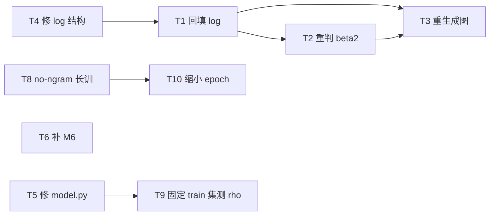

# Plan 3 · Bug 清污、数据回填与下一阶段实验

> **面向对象**：agent 阵列。每个任务卡自包含，可独立分派。
> **前置阅读**：`agents.md` §0（工作原则）+ §1（极简 setting SSOT）+ `docs/experiment-lines.md`。
> **后续**：新标准（β₂=0.99 · 表学习率 ×2）确定后，全量重刷清单见 **`plan-4-rerun-new-standard.md`**（待用户 review，不自动启动）。
**状态**：2026-08-23 立。代码侧两个 bug 已修复，污染数据已删除；**文档侧尚未回填**。

---

## 0. 背景：发生了什么

`code/train.py` 曾有两个 bug，已修复：

| bug | 症状 | 修复位置 |
|---|---|---|
| **B1** freq-bin 诊断复用训练迭代器 | 每次 freq eval 白吃 5 个 train batch（永不参与优化），epoch 计数虚高。所有 launcher 都传 `--freq_index`，故**全部历史 run 受影响** | 独立 `freq_train_ds` 迭代器 |
| **B2** `table_betas[1]` 被静默覆盖 | `_table_rmsprop_step` 里 `b2` 错取 `self.ngram_beta2`，**所有显式传 `--table_betas` 的 rmsprop run 实际都跑 b2=0.999** | `code/train.py:537` `b2 = self.table_betas[1]` |

**已完成的清污**：`data/runs/`（118 MB / 64 run）、`runs_fixed/` 里不带 `_fixed` 的陈旧副本、
`docs/_archive/figs_history/`（6 MB pre-fix 图）、`gen_all_figures_v10.py`（重复旧生成器）——全部**彻底删除**。

**尚未完成**：`docs/experiment-log.md` 全文数值仍是 pre-fix 的，与 `_fixed` 数据直接矛盾。

**唯一权威数据**：`data/runs_fixed/` 中带 `_fixed` 后缀的 run。

### 通用规则（所有任务卡适用）

1. **pre-fix 数值直接覆盖，不保留**。不要写 `(pre-fix: 1.931)` 之类的对照——按仓库原则，
   bug 内容彻底删除，避免污染。唯一例外是 `experiment-lines.md` 的「修正幅度」表，
   它的作用是证明这次修复的必要性，保留。
2. 任何结论必须标注 **run_id + step + seed 数**。
3. 改代码前先 commit；跨机跑实验前 `md5sum` 核对 `code/`。
4. **高频提交**。一个任务卡一个 commit，写清 what + why。
5. 遇到与本 plan 冲突的既有文档，以 `agents.md` §1 为准，并在 commit message 里说明。

---

## P0 · 清污收尾（无需 GPU，可立即并行）

### T1 · 回填 `experiment-log.md`

**问题**：全文 gap 数值是 pre-fix 的，与权威数据矛盾。

**做什么**
1. 遍历 `data/runs_fixed/*_fixed/summary.json`，建立 `run_id → {final_gap, train, val, steps, epochs, ...}` 映射。
2. 逐 section 用 `_fixed` 数值**覆盖**旧数值；run_id 一律补 `_fixed` 后缀。
3. 若某 section 引用的 run 在 `runs_fixed/` 里**不存在**（例如已删除的 M1 v50 波次
   `nglab_input/nogram/v/y`、`nglab2x_*`、`nglab2_5x_*_v2`、`nglab3x/4x_*_v2`），
   **不要保留其数值**——把该 section 标记为
   `⛔ 数据已删除（pre-fix 且已被 <替代 run> 取代），结论作废` 并指向替代 run。
4. 每个 section 顶部加一行 `数据源：data/runs_fixed/<run_id>_fixed/summary.json`。

**验收**
- `rg -n "1\.931|5\.049|5\.041|0\.231|2\.376|0\.643|12\.99" docs/experiment-log.md` 无输出。
- 文中每个 gap 数值都能在某个 `_fixed/summary.json` 里找到。
- 建议顺手写一个 `docs/plot_scripts/dump_runs_table.py`，从 `runs_fixed/` 生成 Markdown 总表，
  让后续回填可复现，不用手抄。

### T2 · 修正 β₂ 相关记录（降级：用户已明确这不是重点）

**背景**：§9c/§9d 的结论「β₂ 影响 ≤ ±0.4，远小于 LR 效应」建立在 B2 bug 之上——
那批 run 的 `--table_betas` 根本没生效，全部实际跑的 b2=0.999。

**为什么降级**：用户已明确表示 β₂ 不是关心的问题（2026-08-23 对话）。
因此不追求新结论、不补跑实验，只做记录修正：

**做什么（并入 T1 回填，不单独占人力）**
1. 回填 §9c/§9d 时，把其中由 B2-bug run 产生的 β₂ 数字**标注为无效**
   （那批 run 实际都是 b2=0.999，参数扫描未生效）。
2. 删除「β₂ 影响小于 LR 效应」这类**无有效数据支撑**的结论句。
3. **不跑任何 β₂ 补充实验**。如果将来真的要选 β₂ 默认值，届时按 `agents.md` §1
   的口径重新设计实验（注意 `--table_betas` 修复后确实生效了）。

**验收**：§9c/§9d 中不存在由 B2-bug run 支撑的「有效」结论；
文中明确写清「β₂ 对比目前无有效证据」。

### T3 · 用 `_fixed` 数据重生成全部图

**做什么**
1. 确认 13 个作图脚本的 `RUNS_DIR` 都指向 `data/runs_fixed`，run_id 都带 `_fixed`。
2. 按线重跑：
   - `gen_all_figures.py` → `docs/figs/main/`（canonical 入口）
   - `analyze_table_opt{,_2x,_1x_vs_2x}.py` → `docs/figs/table_opt/`
   - `gen_shard_sweep_figs.py` / `gen_epoch_scale_figs.py` / `gen_epoch_aligned_figs.py` /
     `gen_nogram_vs_epochaligned_figs.py` → `docs/figs/epoch_scale/`
   - `gen_short_epoch_b2_figs.py` → `docs/figs/short_epoch_b2/`（M7 的图从未按 `_fixed` 重生成）
   - `gen_within_epoch_figs.py` / `gen_zipf_experiment_figs.py` / `analyze_zipf_gap.py` → `docs/figs/toy/`
3. 图表规范遵守 skill `ngram-gap-plotting` 与 `docs/plot_scripts/README.md`。
4. 任何脚本因引用已删除 run 而失败，**不要造假数据**——把该图标为待补并在 plan 里登记。

**验收**：`docs/figs/` 下每张图都由当前脚本 + `_fixed` 数据可复现；无脚本报错。

### T4 · 修 `experiment-log.md` 结构

- §10 出现两次（「基础统计归档」与「shard 扫描」是两个不同实验）→ 重新编号。
- §5 缺失 → 补或说明为何跳号。
- §10 内约 90 行逐字重复 → 删重复。
- 顶部补目录，每个 section 一行摘要。

**验收**：section 编号连续无重复，无逐字重复段落。

---

## P1 · 结构与可信度

### T5 · 修 `ngram5_freq_gap/model.py` 的死 fallback

**问题**：`model.py` 依次尝试仓库根 `train.py`、集群 `/data3/.../train.py`、
`nanogpt_gap_vanilla_control/` —— **三个在本仓库都不存在**，本地 `import model` 直接失败。
`data_gen.py` 的 `_load_upstream_lib()` 同理。

**后果**：`ngram5_freq_gap/README.md` §2 那张「符合极简 setting」的表**只是环境变量声明，
无法在仓库内验证**，因为真正的 backbone 代码不在这里。

**做什么**
1. 把 `model.py` 的 fallback 改为主线 `code/train.py`，确认能取出 `NanoGPTOriginal`。
2. 若主线 `code/train.py` 的类名/结构不匹配，写一个薄适配层，**不要复制第二份 nanoGPT**。
3. 跑 `ngram5_freq_gap/tests`（22 个纯 CPU 单测）确认无回归。
4. 顺带核对：该包是否真的没有 B1/B2 两个 bug（README 声称没有，需代码级确认）。

**验收**：`python -c "import sys; sys.path.insert(0,'ngram5_freq_gap'); import model"` 成功；
单测全绿；README §2 的每一项都能在代码里指出出处。

### T6 · 补 M6 缺口或限定结论

**问题**：`experiment-log.md` §12 结论「对齐 epoch 后 shard 单调关系消失」
只有 **8/12 个点**支撑，缺的恰是最能证伪的大 shard 端：**4x / 5x / 6x / 8x**。

**做什么**：二选一，需用户拍板。
- (a) 补跑 4 个 e6 run（`nglab{4,5,6,8}x_e6`），setting 同 §12 现有点。
- (b) 保留结论但显式写明「仅在 0.25x–3x 范围内验证」。

**验收**：结论的覆盖范围与实际数据一致。

### T7 · full-163 线 ✅ 已解决（2026-08-23）

**决策：脚本删除，数据坐标入库。**

- 已删除：`run_big_continuous.sh`、`launch_ddp_train.sh`、`monitor_full163.sh`
  （从未跑完、依赖仓库外文件、非极简主线；git 历史可查，但不要复活）。
- 完整数据集的**坐标、划分方案、生成参数**已登记在
  `docs/notes/data/full-corpus-full163.md`。
- 以后用完整数据做仿真实验时，按那份文档重建流程，并按 `agents.md` §1
  的极简 setting 重新规划——不依赖任何已删脚本。

## P2 · 下一阶段实验（需 GPU，按序做）

### T8 · 长时程 no-ngram 对照【缩小 epoch 时的保险，跑之前必须先做】

**科学问题**：**backbone 单独长训会不会也产生 gap？**
如果会，那 gap 就不能全部归因给 n-gram 表，后续所有实验的解释口径都要改。

**触发条件**：这条实验**不是所有实验的前置**，而是**"准备大幅缩短每个 epoch 的数据量"这个动作的保险**。
用户原话的语境是——假如我们要大幅减少 epoch 长度（为了加快实验、让 gap 更明显，即 T10），
那么**在缩小之前**必须先跑这个。原因：数据量缩小后 gap 会变大，
如果这时还不知道"没有记忆表的 backbone 自己会不会也过拟合"，
就无法判断变大后的 gap 是记忆表造成的，还是 backbone 自己造成的。
所以：**先跑 T8 定基线 → 再做 T10 缩短数据**。如果近期不做 T10，T8 可以缓跑。
现有 no-ngram 对照只到 2000 步（`nglab1x_v10_nogram_fixed`，gap 0.245），
而 toy L1 的证据显示 backbone 长训到 104 epoch 后低频键 gap 会从 13.2 涨到 20.7——
**backbone 确实会过拟合，只是慢且浅**，所以基线不能只看 2000 步。

**setting**：`agents.md` §1，唯一改动 = **关闭 n-gram 表** + 步数拉长到 **8000–10000**。
- `--enable_bigram_ve false --enable_trigram_ve false`
- seed 42 / 43 / 44 三个种子（这是基线，必须有误差棒）
- val 每 10 步，fixed batches；同时开 freq-bin eval

**要看什么**
1. gap 随步数的曲线形状：是否单调上升？何时开始翘？
2. **按频率分解**：backbone 的 gap 是否也集中在低频？
   预测（来自两因素模型）：backbone 的 T 更 dense，单样本残差被平均，
   所以 gap 应当**更晚出现、更平缓、且随频率变化更弱（β 更小）**。
3. 与带表的 run 对比：同样步数下 gap 差多少倍。

**run_id**：`nglab1x_nogram_long_s{42,43,44}`

**验收**：能明确回答「backbone 单独在 10000 步内是否产生显著 gap」，并给出频率分解图。

### T9 · 固定 train 采样集合的 loss 曲线（测 ρ）

**科学问题**：直接测量**记忆进度 ρ**，而不是只看 gap。

**为什么重要**：外部两因素模型
（`/Users/guoshaoyang/Documents/Codex/2026-08-21/xian-xi/outputs/ngram-repeat-gap-two-factor-model.html`）
把 gap 分解为 `ρ(E,f) × G(f)`，其中 `ρ = 1 − exp(−c·f^γ)`、`G ∝ f^−β`。
该文档第 8 节明确警告：**只拟合 gap 在低 x 区域无法分辨 A 与 c**。
现有全部证据都停在「gap 曲线」这一层，乘法分解从未被直接测量。

当前 train loss 是**在线 batch 平均**，混入了每个 epoch 内频率的重新洗牌，
不是「同一批残差的拟合进度」，因此测不了 ρ。

**做什么**
1. 训练开始前抓取一个**固定不变**的 train 子集（建议 8–16 个 batch，随机但固定 seed）。
2. 与 val **同频率（每 10 步）**记录该固定集合的 loss —— 这条曲线就是 ρ 的直接观测。
3. **同时记录该固定集合的 per-frequency-bin loss**，这样一次 run 就能同时给出
   `ρ(f)` 和 `gap(f)`，可直接拟合 β、c、γ，不需要先验假定幂律。
4. log 频率不要更高（每 10 步已足够），避免拖慢训练。

**实现提示**：`ngram5_freq_gap/trainer.py` 已有 `fixed_train_probe_batches` 的成熟实现
（materialized 固定 batch 列表 + SHA256 记账 + `itertools.chain` 保证不跳数据）。
**移植它，不要重写**。注意主线 `code/train.py` 必须避免重蹈 B1——探针绝不能消费训练迭代器。

**run_id**：`nglab1x_input_rho_s42`

**验收**：产出 `fixed_train_loss.jsonl`（每 10 步）+ 对应的 per-bin 版本；
能画出 ρ(step) 与 ρ(f) 两条曲线。

### T10 · 缩小单 epoch 数据量以放大 gap

**前置条件**：**T8 必须先完成**。这不是流程洁癖——数据缩小后 gap 会变大，
不先有 backbone 单独长训的基线，就无法判断变大后的 gap 归因于记忆表还是 backbone。

**做什么**：在 T8 确认 backbone 基线之后，缩小 shard 以加快实验并放大 gap。
`experiment-log.md` §10 的 shard 扫描已覆盖 0.25x–8x，先复用其结论选点，不要盲扫。

**已知坑**
- 数据量缩小会让 backbone 欠拟合（§19 的 MLP 就是反例）。
- epoch 边界要重新算频率索引，不能沿用大 shard 的 `freq_index.npz`。

---

## P3 · 工程整理（低优先，随手做）

| # | 任务 |
|---|---|
| T11 | `RUNS_DIR` 环境变量化。现在 13 个脚本各自硬编码，下次再出 bug 又要改 13 处 |
| T12 | 抽 `docs/plot_scripts/table_opt_common.py`。三个 `analyze_table_opt*.py` 约 40% 行重复（三个入口保留，问题确实不同） |
| T13 | `ngram5_freq_gap` 更名 `controlled_ngram`（包名 `ngram5` 是历史误称，launcher 实际跑 `--order 3`）。需同步 3 个调用点 + 集群 rsync 路径 |
| T14 | `ngram5_freq_gap/resample_aligned_dataset.py` 无 launcher 引用，确认后删除 |
| T12 | ✅ 干预机制已接线：`apply_intervention()` + `table_mult` 已接通 CLI → Config → 主循环（一次性闩锁）。`run_causal_minimal.sh` 就位。**只剩在 GPU 上实跑验证**（因果重跑队列，见 `agents.md` §6.3） |

---

## 任务依赖图

**并行建议**：
- 第一批（无 GPU，可 4 路并行）：T1、T4、T5、T11+T12
- 第二批（依赖第一批）：T2、T3
- 第三批（GPU）：**T8 与 T9 可以同时开跑，互不依赖**。
  **T10 必须等 T8 出结果后再启动**（这是唯一的硬依赖）。

---

## 与外部两因素模型的对照

主实验目前**支持**该模型的四条：
T 结构（table 近似 diagonal / backbone dense）、G(f) ∝ f^−β 低频更危险、
ρ 随重复单调累积、epoch2 的 optimistic bias。

**尚未验证的三个可证伪点**——这正是 T9 要补的：
1. 从未直接测量 ρ 或 τ，乘法分解 `ρ × G` 未被检验。
2. 未按 bigram/trigram × epoch 分开拟合 β、c、γ，也未检验 c 能否跨 epoch 共享。
3. **频率与重复次数没有解耦**。该模型第 8 节的首要建议是
   「固定独立样本数扫 table touches；固定 touches 扫独立样本数」。
   现有实验里 f 与 epoch 数绑定（都是数据量/步数的副产品），不能单独归因。

第 3 点建议作为 T9 之后的 T15 立项。
